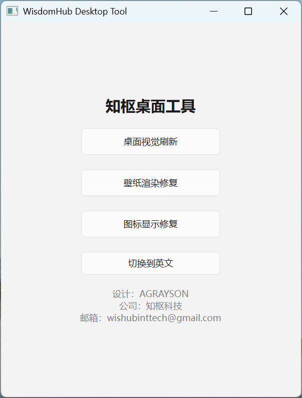

# 🔥 WisdomHub Desktop Tool v1.0 Enterprise

<p align="center">


</p>

---

## 🚀 Professional Windows Desktop Optimization Tool

Modern UI · Explorer & Wallpaper Fix · Icon Cache Repair · CN/EN Language Support

---

## 📸 Software Preview

<p align="center">

</p>

---

## ✨ Features

✔ **Refresh Visual Trails** – Clear desktop residual artifacts, restart Explorer.exe  
✔ **Fix Wallpaper Rendering** – Solve black/blank wallpaper issues  
✔ **Fix Icon Display** – Repair white or missing desktop icons  
✔ **Language Switching (CN / EN)** – Toggle interface language instantly  
✔ **Modern UI** – Clean vertical layout, easy for personal and enterprise use  
✔ **Information Panel** – Display designer, company, and contact info  
✔ Ready for **EXE packaging** for easy distribution  

---

## 📦 Run From Source

```bash
pip install pyqt6
python WisdomHub_Desktop_Tool.py

```
## 💎 Download Windows EXE

👉 Download the latest compiled version from the **Releases** section:

[⬇ Click Here to Download](../../releases)

⚠️ Note: Some features (Explorer restart, icon cache repair) require **administrator privileges**.

---

## 👤 Author & Company

**Designer:** AGRAYSON  
**Company:** 知枢科技 / WisdomHub Intelligent Technology Co., Ltd  
**Email:** wishubinttech@gmail.com

---

## ⭐ Support This Project

If you like this project, please consider giving it a ⭐ on GitHub!  

It helps the project grow and reach more users 🚀

